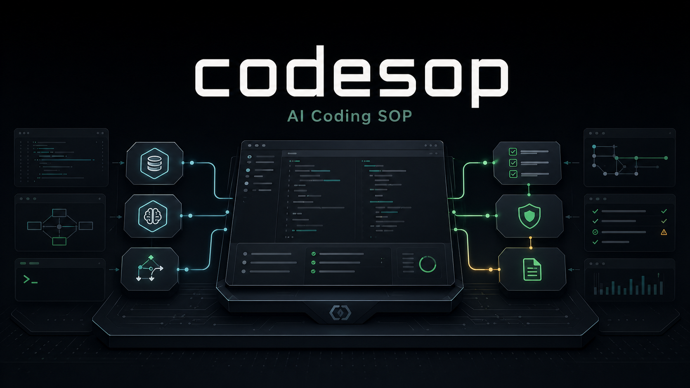

**English** | [中文](README.md)

<p align="center">
  
</p>

<p align="center">
  <strong>Skill-first workflow OS for AI-assisted coding</strong><br>
  Give your AI SOP discipline — knowing which skill to use, what order to execute, and when to stop and verify
</p>

<p align="center">
  
  
  
</p>

---

> Don't know how to get AI to write code for you? Don't know what docs to prepare? Long tasks spinning out of control? Afraid to trust AI-generated code?
>
> codesop solves these problems. Install once, every project is AI-ready.

## Quick Start

**Copy and paste** this prompt to your AI coding assistant:

```text
Install codesop — an AI coding workflow OS. Follow these steps:
1. git clone https://github.com/veniai/codesop.git ~/codesop
2. cd ~/codesop && bash install.sh
3. Verify ~/.local/bin/codesop is executable (add ~/.local/bin to PATH in ~/.bashrc or ~/.zshrc if needed)
4. Run codesop init . in the current project directory to initialize
After installation, explain how to use the /codesop workbench.
```

Once installed:

```bash
/codesop init .    # Initialize current project
/codesop           # Open the workbench
```

<details>
<summary>Manual install</summary>

```bash
git clone https://github.com/veniai/codesop.git ~/codesop
cd ~/codesop && bash install.sh
```

Make sure `~/.local/bin` is on your `PATH`.

</details>

## What it does

`/codesop` is your AI coding workbench. Every time you enter a project:

1. **Restore context** — reads AGENTS.md and PRD.md to understand project state
2. **Route** — selects the best skill chain from the routing table based on your intent
3. **Pipeline execution** — converts the chain into a task list (☐/☑ progress), auto-executes step by step
4. **Verification gate** — every step must pass verification before completion, no skipping

Cross-tool support: Claude Code (primary) · Codex · OpenCode

## Key Highlights

**One-Command Init** — Run `/codesop init .` after installing. Auto-generates all AI collaboration docs: AGENTS.md (discipline), PRD.md (product progress), README.md (usage guide), ADR (architecture decisions). Also syncs system-level config to `~/.claude/CLAUDE.md`. Install once, every project is AI-ready.

**Four Iron Laws** — Design before coding · Fail before producing · No fix without root cause · No completion without evidence. AI can't just write code freely — every step is discipline-constrained.

**Skill Routing** — Don't know which skill to use? The routing table picks for you. New features → brainstorming → plan → dev → verify. Bugs → debugging → verify. No guessing required.

**Long Task Orchestration** — Pipeline task list with auto-split, sequential execution, ☐/☑ visual progress. Long development sessions stay on track without losing control.

**Iterative Questioning** — The brainstorming skill uses iterative requirement clarification: ask → understand → ask deeper, progressively converging on real requirements before writing any code.

**Context Management** — Every time you enter a project, AI auto-reads AGENTS.md (discipline) + PRD.md (product progress) and restores full context. No more "AI forgot what it did last time."

**ADR (Architecture Decision Records)** — Auto-detects architecture decision conflicts. Reads ADRs before cross-module changes, preventing duplicate or contradictory decisions.

**Documentation Gate** — Before completing any task, auto-evaluates whether CLAUDE.md / PRD.md / README.md need updates, preventing docs from drifting behind code.

## Scenarios

| What you want | /codesop chain |
|--------------|----------------|
| New feature | brainstorming → design review → plan → dev → verify → submit PR |
| Bug fix | root cause → verify → submit PR |
| Small change | dev → verify → submit PR |
| PR feedback | evaluate → fix → full test → submit |

<details>
<summary>Skill Ecosystem</summary>

codesop orchestrates these skills:

- **[superpowers](https://github.com/obra/superpowers)** — brainstorming, writing-plans, TDD, systematic-debugging, subagent-dev, verification
- **code-review** — 5-agent parallel PR review + confidence scoring
- **codex** — dual-AI review (design + code review phases)
- **claude-md-management** — document drift detection
- **code-simplifier** — code polish

```bash
/plugin install superpowers                      # Claude Code
/plugin install code-review
/plugin marketplace add openai/codex-plugin-cc
```

</details>

<details>
<summary>Initialize a project</summary>

```bash
/codesop init .
```

Auto-scans project shape and generates the files your AI assistant needs:

- `AGENTS.md` → `@CLAUDE.md` (AI entry point)
- `PRD.md` → product spec + progress + work log
- `README.md` → install/run/test commands (if missing)
- `docs/adr/` → architecture decision records

</details>

<details>
<summary>Architecture</summary>

```
codesop                     # CLI entrypoint
setup                       # Host integration sync
├── lib/                    # Core shell modules
├── SKILL.md                # /codesop definition
├── commands/               # Slash command files
├── config/
│   └── codesop-router.md   # Router card
├── templates/
│   ├── system/             # System-level AGENTS.md template
│   ├── project/            # PRD.md, README.md templates
│   └── init/               # Init prompt templates
├── tests/                  # Contract tests
├── AGENTS.md               # → @CLAUDE.md
├── CLAUDE.md               # Project guide
├── PRD.md                  # Living document
```

</details>

<details>
<summary>Testing</summary>

```bash
bash tests/run_all.sh
```

</details>

## License

MIT
