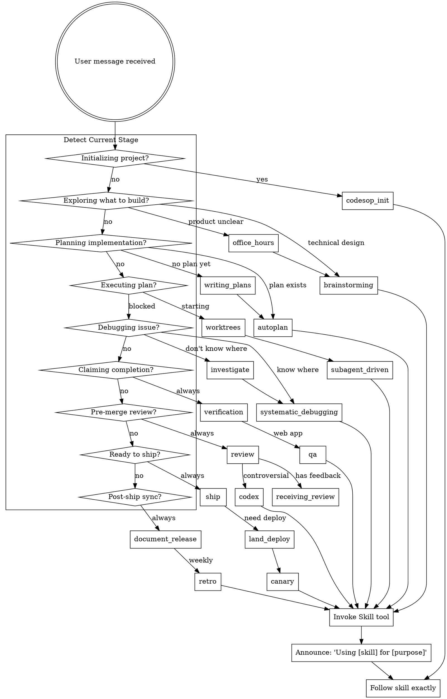

<SUBAGENT-STOP>
If you were dispatched as a subagent to execute a specific task, skip this skill.
</SUBAGENT-STOP>

<EXTREMELY-IMPORTANT>
This skill is a **workflow router** that spans superpowers + gstack. It enforces development discipline across the entire project lifecycle.

IF A WORKFLOW STAGE HAS A MANDATORY SKILL, YOU MUST USE IT. This is not optional.

The rules below define what MUST happen at each stage. You cannot skip stages. You cannot substitute your judgment for the discipline.
</EXTREMELY-IMPORTANT>

## Instruction Priority

1. **User's explicit instructions** (CLAUDE.md, AGENTS.md, direct requests) — highest priority
2. **This skill's mandatory workflow** — overrides default behavior
3. **Individual skill instructions** — when invoked
4. **Default system prompt** — lowest priority

If CLAUDE.md says "skip TDD" and this skill says "TDD is mandatory", follow CLAUDE.md. The user is in control.

---

## How to Access Skills

**In Claude Code:** Use the `Skill` tool. When you invoke a skill, its content is loaded—follow it directly.

**Skill naming:**
- Superpowers: `superpowers:brainstorming`, `superpowers:writing-plans`, etc.
- gstack: `gstack-review`, `gstack-qa`, `gstack-ship`, etc.
- codesop CLI commands: `codesop-init`, `codesop-status`, `codesop-setup`, `codesop-update`

---

# The Development Pipeline

This is the **mandatory workflow** for any development work. Each stage has required skills. You cannot skip stages.

```
┌─────────────────────────────────────────────────────────────────────────────┐
│                         DEVELOPMENT PIPELINE                                  │
├─────────────────────────────────────────────────────────────────────────────┤
│                                                                              │
│  1. EXPLORATION                                                              │
│     "What should we build?"                                                  │
│     ├─ Product direction unclear → gstack:office-hours                      │
│     └─ Technical design needed → superpowers:brainstorming [MANDATORY]      │
│                                                                              │
│  2. PLANNING                                                                 │
│     "How do we build it?"                                                    │
│     ├─ Write plan → superpowers:writing-plans [MANDATORY]                   │
│     └─ Review plan → gstack:autoplan [MANDATORY]                            │
│                                                                              │
│  3. EXECUTION                                                                │
│     "Build it"                                                               │
│     ├─ Isolate workspace → superpowers:using-git-worktrees [MANDATORY]      │
│     ├─ Execute → superpowers:subagent-driven-development [MANDATORY]        │
│     │            (executing-plans is FALLBACK only)                          │
│     └─ During dev → superpowers:test-driven-development [MANDATORY]         │
│                                                                              │
│  4. DEBUGGING (when blocked)                                                 │
│     "Something's broken"                                                     │
│     ├─ Don't know where → gstack:investigate                                │
│     └─ Know where, fear breaking → superpowers:systematic-debugging         │
│                                                                              │
│  5. VERIFICATION                                                             │
│     "Did we build it right?"                                                 │
│     ├─ Run commands → superpowers:verification-before-completion [MANDATORY]│
│     └─ Web app → gstack:qa [MANDATORY for web]                              │
│                                                                              │
│  6. REVIEW                                                                   │
│     "Is it safe to merge?"                                                   │
│     ├─ Structural risks → gstack:review [MANDATORY]                         │
│     ├─ Process → superpowers:requesting-code-review                         │
│     └─ Controversial → gstack:codex + receiving-code-review                 │
│                                                                              │
│  7. RELEASE                                                                  │
│     "Ship it"                                                                │
│     ├─ Create PR → gstack:ship [MANDATORY]                                  │
│     ├─ Merge + deploy → gstack:land-and-deploy                              │
│     └─ Post-deploy → gstack:canary                                          │
│                                                                              │
│  8. CLEANUP                                                                  │
│     "Sync everything"                                                        │
│     ├─ Docs → gstack:document-release [MANDATORY]                           │
│     └─ Weekly → gstack:retro                                                │
│                                                                              │
└─────────────────────────────────────────────────────────────────────────────┘
```

---

# Trigger Signal → Skill Routing

When the user says something, route to the appropriate skill:

## Stage 1: Exploration

| User Signal | Route To | Mandatory? |
|-------------|----------|------------|
| "不知道做什么" / "方向不明确" | gstack:office-hours | No |
| "要做 X 功能" / "加个 Y" | superpowers:brainstorming | **YES** |
| "重构 Z" / "改进 W" | superpowers:brainstorming | **YES** |
| "修个 bug" (no exploration needed) | Skip to Stage 4 | — |

## Stage 2: Planning

| User Signal | Route To | Mandatory? |
|-------------|----------|------------|
| "写计划" / "怎么做" | superpowers:writing-plans | **YES** |
| "审一下计划" / "看看计划行不行" | gstack:autoplan | **YES** |
| "CEO 视角审计划" | gstack:plan-ceo-review | No |
| "设计视角审计划" | gstack:plan-design-review | No |
| "工程视角审计划" | gstack:plan-eng-review | No |

## Stage 3: Execution

| User Signal | Route To | Mandatory? |
|-------------|----------|------------|
| "开始做" / "执行" | superpowers:subagent-driven-development | **YES** |
| "多个独立问题" | superpowers:dispatching-parallel-agents | No |
| "写代码" (direct) | superpowers:test-driven-development | **YES** |

## Stage 4: Debugging

| User Signal | Route To | Mandatory? |
|-------------|----------|------------|
| "不知道 bug 住哪" / "排查一下" | gstack:investigate | No |
| "知道问题但怕修错" | superpowers:systematic-debugging | **YES** |
| "测试挂了" | superpowers:systematic-debugging | **YES** |

## Stage 5: Verification

| User Signal | Route To | Mandatory? |
|-------------|----------|------------|
| "做完了" / "修好了" | superpowers:verification-before-completion | **YES** |
| "跑一下看看" / "测一下" | gstack:qa | **YES** (web) |
| "只看报告不改" | gstack:qa-only | No |
| "性能问题" | gstack:benchmark | No |

## Stage 6: Review

| User Signal | Route To | Mandatory? |
|-------------|----------|------------|
| "review 一下" / "合并前看看" | gstack:review | **YES** |
| "外部意见" / "对抗测试" | gstack:codex | No |
| "收到 review 反馈" | superpowers:receiving-code-review | **YES** |

## Stage 7: Release

| User Signal | Route To | Mandatory? |
|-------------|----------|------------|
| "发布" / "ship" / "推 PR" | gstack:ship | **YES** |
| "合并" / "部署" | gstack:land-and-deploy | **YES** |
| "配置部署" | gstack:setup-deploy | No |
| "部署后监控" | gstack:canary | **YES** |

## Stage 8: Cleanup

| User Signal | Route To | Mandatory? |
|-------------|----------|------------|
| "更新文档" / "同步文档" | gstack:document-release | **YES** |
| "周报" / "复盘" | gstack:retro | No |

## Safety & Utilities

| User Signal | Route To | Mandatory? |
|-------------|----------|------------|
| "小心点" / "别搞坏" | gstack:careful | No |
| "只改这个目录" | gstack:freeze | No |
| "最大安全模式" | gstack:guard | No |
| "解冻" | gstack:unfreeze | No |
| "浏览器里看看" | gstack:browse | No |
| "导入 cookie" | gstack:setup-browser-cookies | No |
| "安全审计" | gstack:cso | No |
| "设计系统" / "从零设计" | gstack:design-consultation | No |
| "视觉审计" / "UI 问题" | gstack:design-review | No |

## codesop Native Commands

| User Signal | Route To | Mandatory? |
|-------------|----------|------------|
| "初始化项目" | codesop-init | **YES** |
| "项目状态" / "诊断" | codesop-status | No |
| "配置 host" | codesop-setup | No |
| "更新 codesop" | codesop-update | No |

---

# Decision Flow



---

# Red Flags

These thoughts mean STOP—you're rationalizing:

| Thought | Reality |
|---------|---------|
| "This is a simple feature, no need for brainstorming" | Brainstorming is **mandatory** before any creative work. |
| "I'll just write the code directly" | TDD is **mandatory** during implementation. |
| "Tests pass, we're done" | verification-before-completion requires **fresh evidence**, not memory. |
| "The code looks fine, let's merge" | gstack:review is **mandatory** before merge. |
| "I don't need QA for this" | Web apps **must** go through gstack:qa. |
| "Docs can wait" | document-release is **mandatory** after ship. |
| "This doesn't need a formal plan" | writing-plans + autoplan are **mandatory** for multi-step work. |
| "I remember what the skill says" | Skills evolve. Invoke the current version. |
| "Let me just try this fix" | No root cause = no fix. Use systematic-debugging. |
| "The user just wants me to code" | Discipline exists to protect the user. Use the pipeline. |

---

# Skill Priority Within Stages

When multiple skills could apply at the same stage:

1. **Process skills first** (brainstorming, systematic-debugging) — determine HOW to approach
2. **Implementation skills second** — guide execution
3. **Verification skills third** — confirm correctness

---

# Skill Types

**Rigid** (TDD, verification, debugging): Follow exactly. Don't adapt away discipline.

**Flexible** (brainstorming, design): Adapt principles to context.

**Conditional** (qa vs qa-only, investigate vs systematic-debugging): Choose based on situation.

The skill itself tells you which.

---

# codesop CLI Commands

When the user explicitly asks for mechanical codesop operations:

| Command | Skill | What it does |
|---------|-------|--------------|
| `/codesop init` | codesop-init | Initialize AGENTS.md, PRD.md, README.md |
| `/codesop status` | codesop-status | Show project diagnosis |
| `/codesop setup` | codesop-setup | Refresh host integrations |
| `/codesop update` | codesop-update | Update local installation |

For these, invoke the corresponding skill. Do NOT re-implement CLI logic in conversation.

---

# The Iron Law

**No stage may be skipped. No mandatory skill may be bypassed.**

If you're about to write code without brainstorming → STOP.
If you're about to claim done without verification → STOP.
If you're about to merge without review → STOP.
If you're about to ship without QA (web) → STOP.

The pipeline exists because undisciplined development wastes time. Follow it.
