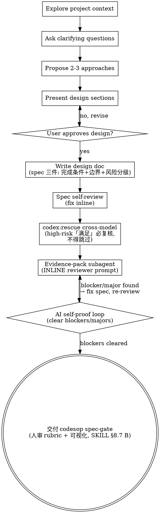

<!--
  codesop patch: brainstorming
  Based on: superpowers v6.0.3
  Changes vs upstream:
    1. Added Grill Mode (code-first answers, decision tree tracking, domain vocabulary alignment)
    2. Added ADR trigger — suggests writing ADR when design involves architectural decisions
    3. Added Domain Language Delta — records new terminology, offers to write into CONTEXT.md
    4. Added CONTEXT.md / docs/adr/ check during context exploration
    5. spec-gate 流程（v9，取代 v8 three-cycles 命名）: spec self-review → codex:rescue cross-model review (high-risk
       enforced per item 7; non-high-risk degrade-on-failure, never silent) → evidence-pack
       subagent with INLINE reviewer prompt (five-dimension table completeness/consistency/
       clarity/scope/YAGNI + Calibration sourced from upstream spec-document-reviewer-prompt.md;
       Output Format adapted to the evidence-pack schema) → AI self-proof loop (clear blockers)
       → 交付 codesop spec-gate（人审归 codesop §8.7 B）. Evidence-pack schema fields reference the
       shared _evidence-pack-schema.md (sibling at runtime — patch_skills syncs both this main
       SKILL.md and the schema file next to it; the reviewer prompt itself lives inline here).
    6. (v9 R1) Spec-as-goal: every spec requirement MUST carry 三件 — 完成条件 (machine-verifiable)
       + 边界 (anti-Goodhart, defined alongside the completion condition) + 风险分级 (low/high).
       The spec IS the goal file; the evidence-pack (a) verdict judges against the spec's declared
       completion condition (not a subjective read of spec prose).
    7. (v9 R9) Cross-model enforcement (tightens v8 degrade-on-failure): high-risk「满足」verdicts
       MUST be re-checked by codex — never mark "跳过". If codex is genuinely unavailable, the
       high-risk「满足」entry degrades to advisory (codesop spec-gate 人审 adjudicates) — it is NOT auto-judged
       满足. Non-high-risk entries: codex unavailable → degrade to advisory (column (c) marked
       "codex 不可用，降级 advisory", human-visible, non-blocking) — never a silent skip, because
       the spec stage MUST walk codex (schema §4: ① spec 必走 codex:rescue). Fixes v7 codex-skip 漏洞
       where codex-unavailable silently bypassed the cross-model anchor.
    8. (first-principles v1) First-principles derivation step added to "Exploring approaches":
       before proposing 2-3 approaches, AI MUST first derive the solution from basic facts /
       constraints (not by copying an analogous pattern from training data), THEN compare
       against analogy-based options and weigh trade-offs. Interrupts AI's default analogy
       reasoning — forces re-derivation from the problem's irreducible facts before any
       "we've done this before" shortcut lands. Complex / moderate tasks walk the derivation;
       simple / trivial may skip (analogy is fast enough, derivation is overhead) — complexity
       threshold reuses writing-plans' existing complexity assessment (no new gate).
  Why: upstream brainstorming assumes single-pass Q&A; grill mode ensures deeper requirement
    exploration before design. ADR trigger and domain-language delta prevent underspecified
    specs from reaching implementation — the #1 cause of rework in codesop pipelines. The
    spec-gate 流程（v4.5：人审归 codesop）adds AI self-proof + cross-model review before handing to codesop spec-gate, so humans
    never receive a half-finished spec to debug. v9 R1 + R9 turn the spec into a goal file
    (三件) and close the codex-skip loophole for high-risk verdicts.
  Revert: delete this file and run `bash setup --host claude` to restore upstream version.
-->
---
name: brainstorming
description: "You MUST use this before any creative work - creating features, building components, adding functionality, or modifying behavior. Explores user intent, requirements and design before implementation."
---

# Brainstorming Ideas Into Designs

Help turn ideas into fully formed designs and specs through natural collaborative dialogue.

Start by understanding the current project context, then ask questions one at a time to refine the idea. Once you understand what you're building, present the design and get user approval.

<HARD-GATE>
Do NOT invoke any implementation skill, write any code, scaffold any project, or take any implementation action until you have presented a design and the user has approved it. This applies to EVERY project regardless of perceived simplicity.
</HARD-GATE>

## Anti-Pattern: "This Is Too Simple To Need A Design"

Every project goes through this process. A todo list, a single-function utility, a config change — all of them. "Simple" projects are where unexamined assumptions cause the most wasted work. The design can be short (a few sentences for truly simple projects), but you MUST present it and get approval.

## Checklist

You MUST create a task for each of these items and complete them in order:

1. **Explore project context** — check files, docs, recent commits
2. **Offer the visual companion just-in-time** — NOT upfront. The first time a question would genuinely be clearer shown than described, offer it then (its own message); on approval its browser tab opens for you. If no visual question ever arises, never offer it. See the Visual Companion section below.
3. **Ask clarifying questions** — one at a time, understand purpose/constraints/success criteria
4. **Propose 2-3 approaches (first-principles first)** — derive the solution from basic facts / constraints BEFORE proposing; then present 2-3 approaches with trade-offs and your recommendation
5. **Present design** — in sections scaled to their complexity, get user approval after each section
6. **Write design doc (spec-as-goal, 三件 required)** — save to `docs/superpowers/specs/YYYY-MM-DD-<topic>-design.md`; EVERY requirement must carry 完成条件 (machine-verifiable) + 边界 (anti-Goodhart) + 风险分级 (low/high); commit
7. **Spec self-review + codex cross-model + evidence-pack + AI self-proof** — inline self-review (placeholders/contradictions/ambiguity/scope), then codex:rescue cross-model (high-risk「满足」MUST be re-checked, never skipped — see below), then dispatch evidence-pack subagent (INLINE reviewer prompt below), then AI self-proof loop (clear blockers/majors)
8. **交付 codesop spec-gate** — brainstorming 完成（spec 三件 + 证据包 blockers 清零）；spec-gate 人审（rubric + 可视化）归 codesop（SKILL §8.7 B），不在 brainstorming

## Process Flow



**The terminal state is 交付 codesop spec-gate.** brainstorming 完成后交 codesop spec-gate（SKILL §8.7 B：人审 rubric + 可视化）；spec-gate 审过后由 codesop 决定调 `/goal` 或（complex）走 writing-plans——brainstorming 不直接进 writing-plans。

## The Process

**Understanding the idea:**

- Check out the current project state first (files, docs, recent commits)
- Also check for: `CONTEXT.md` at the project root (domain vocabulary), and `docs/adr/` directory (architecture decision records). Read them if they exist. If they don't exist, proceed silently — don't suggest creating them.
- Before asking detailed questions, assess scope: if the request describes multiple independent subsystems (e.g., "build a platform with chat, file storage, billing, and analytics"), flag this immediately. Don't spend questions refining details of a project that needs to be decomposed first.
- If the project is too large for a single spec, help the user decompose into sub-projects: what are the independent pieces, how do they relate, what order should they be built? Then brainstorm the first sub-project through the normal design flow. Each sub-project gets its own spec → plan → implementation cycle.
- For appropriately-scoped projects, ask questions one at a time to refine the idea
- Prefer multiple choice questions when possible, but open-ended is fine too
- Only one question per message - if a topic needs more exploration, break it into multiple questions
- Focus on understanding: purpose, constraints, success criteria

**Grill Mode** — structural enhancements to Step 3:

1. **Code-first answers**: When a question can be answered by reading code, read the code first instead of asking the user to guess. When the user describes existing behavior, verify against the codebase before accepting the claim.

2. **Decision tree tracking**: Maintain an implicit decision tree: resolved / pending / depends-on-other-decision. Each question maps to a node. **Exit condition**: stop grilling when purpose, constraints, success criteria, and major decision dependencies are clear enough to support 2-3 concrete approaches. Then proceed to Step 4.

3. **Domain vocabulary alignment**: If CONTEXT.md exists in the project, use its terms when framing questions. When new terminology reaches consensus, record it in the spec's `## Domain Language Delta` section (create this section if it doesn't exist). When the user's language conflicts with CONTEXT.md, call it out: "Your glossary defines X as A, but you seem to mean B — which is it?"

**Exploring approaches (第一性原理推导 first-principles derivation):**

- **第一性原理推导 (first-principles derivation, BEFORE proposing approaches):** AI's default mode is analogy reasoning — it reaches for a pattern that worked on a similar-seeming problem in training data. Interrupt that. Before proposing any approach, **derive the solution from the problem's irreducible basic facts and constraints** (第一性原理): what MUST be true for any correct solution? What are the hard constraints (physics of the system, invariants, scale, latency, security)? What is the minimum that has to exist? Only after the derivation do you have a grounded basis for comparing options — the alternative is照搬类比 (copying an analogous pattern) without checking whether it fits *this* problem.
  - **Walk this for complex / moderate tasks.** simple / trivial tasks may skip — analogy is fast enough there, and forcing a derivation is overhead. Complexity threshold reuses `writing-plans-SKILL.md`'s existing complexity assessment (no new gate).
  - **Compare derivation vs analogy:** after the 第一性原理 derivation, explicitly weigh it against the analogy-based option the AI would have reached by default. If they diverge, name the divergence and why — the divergence is usually where the analogy was wrong for *this* problem. If they converge, the derivation still confirms the analogy rather than inheriting it unexamined.
- Propose 2-3 different approaches with trade-offs (the 第一性原理-derived approach is one of them)
- Present options conversationally with your recommendation and reasoning
- Lead with your recommended option and explain why — if the recommendation diverges from the "obvious analogy" approach, say so explicitly

**Presenting the design:**

- Once you believe you understand what you're building, present the design
- Scale each section to its complexity: a few sentences if straightforward, up to 200-300 words if nuanced
- Ask after each section whether it looks right so far
- Cover: architecture, components, data flow, error handling, testing
- Be ready to go back and clarify if something doesn't make sense

**Design for isolation and clarity:**

- Break the system into smaller units that each have one clear purpose, communicate through well-defined interfaces, and can be understood and tested independently
- For each unit, you should be able to answer: what does it do, how do you use it, and what does it depend on?
- Can someone understand what a unit does without reading its internals? Can you change the internals without breaking consumers? If not, the boundaries need work.
- Smaller, well-bounded units are also easier for you to work with - you reason better about code you can hold in context at once, and your edits are more reliable when files are focused. When a file grows large, that's often a signal that it's doing too much.

**Working in existing codebases:**

- Explore the current structure before proposing changes. Follow existing patterns.
- Where existing code has problems that affect the work (e.g., a file that's grown too large, unclear boundaries, tangled responsibilities), include targeted improvements as part of the design - the way a good developer improves code they're working in.
- Don't propose unrelated refactoring. Stay focused on what serves the current goal.

## After the Design

**Documentation:**

- Write the validated design (spec) to `docs/superpowers/specs/YYYY-MM-DD-<topic>-design.md`
  - (User preferences for spec location override this default)
- Use elements-of-style:writing-clearly-and-concisely skill if available
- **(v9 R1) Spec-as-goal — every requirement MUST carry 三件:**
  - **完成条件 (completion condition)** — machine-verifiable, not "优化一下". Concrete form: a runnable check or explicit external signal, e.g. "`tests/auth/ 全过 + tsc 零报错`", "`grep -c … ≥ N`", "`verification 证据包 blocking 清零`". Avoid prose-only conditions a human must subjectively judge.
  - **边界 (anti-Goodhart boundary)** — defined ALONGSIDE the completion condition, on the same field/card. States what cannot be shrunk to satisfy the condition: "测试覆盖率不降 / 不删测试 / lint 规则数不减" etc. The boundary is a hard floor — satisfying the completion condition while violating the boundary = the whole entry fails (prevents drilling holes: meet the surface condition by silently deleting tests / lowering coverage / widening lint).
  - **风险分级 (risk tier)** — `low` or `high`, with a one-line reason. `low` = pure refactor / no public behavior change / single-module. `high` = changes public behavior / cross-module / external interface. Risk tier decides whether deliver-gate forces human review (high) or auto-passes (low). Do NOT leave blank — blank = treat as high (conservative).
  - **Why three:** the spec IS the goal file. `/goal` and downstream cycles consume the completion condition as the loop's exit signal; the boundary is the floor /goal cannot trade away; the risk tier routes the deliver-gate. An under-specified completion condition caps the whole pipeline — spec quality is the /goal ceiling, and this gate is the ceiling check.
- Commit the design document to git

**ADR trigger:** When the design involved architectural decisions, significant trade-offs, or choosing between multiple approaches, check if `docs/adr/` exists in the project. If it does, suggest writing an ADR alongside the spec. Use format `NNNN-decision-title.md` with sections: 决策 / 上下文 / 结果. Commit the ADR with the spec. Simple changes with no meaningful decisions do not trigger this.

After spec approval, if the spec contains a `## Domain Language Delta` section, ask the user whether to write these terms into the project's CONTEXT.md (creating the file if needed). If the user agrees, update CONTEXT.md with the delta terms following the format: term definition + Avoid list.

**Spec Self-Review (AI inline, first pass):**
After writing the spec document, look at it with fresh eyes:

1. **Placeholder scan:** Any "TBD", "TODO", incomplete sections, or vague requirements? Fix them.
2. **Internal consistency:** Do any sections contradict each other? Does the architecture match the feature descriptions?
3. **Scope check:** Is this focused enough for a single implementation plan, or does it need decomposition?
4. **Ambiguity check:** Could any requirement be interpreted two different ways? If so, pick one and make it explicit.
5. **(v9 R1) 三件 check:** Every requirement carries a machine-verifiable 完成条件 + a 同字段 边界 + a low/high 风险分级 (see "Spec-as-goal" above). Entries missing any of the three are themselves a blocker — fix inline before proceeding.

Fix any issues inline. No need to re-review — just fix and move on. This is the AI's own first pass; the cross-model + evidence-pack steps below are the external anchors that follow.

**Cross-Model Review (codex:rescue — v9 R9 high-risk enforcement, non-high-risk degrade-on-failure):**
Immediately after the inline self-review, invoke `codex:rescue` to cross-model review the spec. The spec stage is the highest-leverage point to catch underspecification before downstream cycles inherit it — this is why cross-model enforcement is strictest here.

- Invoke the `codex:rescue` skill with a prompt like: "Cross-model review the spec at `<SPEC_PATH>`. Look for: placeholders/TODOs, internal contradictions, requirements ambiguous enough to cause someone to build the wrong thing, scope drift across multiple independent subsystems, unrequested/over-engineered features (YAGNI), AND — per v9 R1 — any requirement missing 三件 (machine-verifiable 完成条件 / 同字段 边界 / low-high 风险分级). Pay extra attention to entries the spec marks `风险分级: high` (public behavior / cross-module / external interface). Report findings verbatim — do not rewrite the spec."
- **Capture codex's output verbatim** (do not rewrite, summarize, or soften). This output lands in the evidence pack's (c) cross-model review column.
- **(v9 R9) High-risk「满足」MUST be re-checked by codex — never mark "跳过".** When the evidence-pack (a) step below judges a `风险分级: high` requirement as 「满足」, that verdict is NOT final until codex has re-reviewed it. This closes the v7 codex-skip 漏洞 where codex-unavailable silently bypassed the cross-model anchor exactly on the riskiest entries.
  - **codex available** → codex re-checks the high-risk「满足」entry; its verbatim finding lands in column (c). If codex disagrees (flags it 没满足 / 顾虑), the entry reverts to blocker/major and re-enters the AI self-proof loop.
  - **codex genuinely unavailable** (skill missing / runtime error / timeout / empty output) → the high-risk「满足」entry **degrades to advisory** (downgrades verdict to `顾虑`, marks "high-risk codex 强制未走，降级 advisory" in column (c), preserved for codesop spec-gate 人审). It is **NOT auto-judged 满足** — codesop spec-gate 人审 decides whether it blocks. The (a) per-requirement and (b) uncovered-scan columns are still produced.
  - **Non-high-risk entries** keep v8's degrade-on-failure: codex unavailable → mark column (c) as `codex 不可用，降级 advisory` and proceed. The spec stage still MUST walk the codex step (schema §4: ① spec 必走 codex:rescue) — when codex is down the entry degrades to advisory (human-visible, non-blocking) rather than being silently skipped. "跳过" = silent anchor loss, which violates R9's spirit; codex being down must NOT block the spec stage for low-risk entries, but the degradation MUST be recorded in column (c).
- **Never silently drop the step.** The evidence pack column (c) must show one of: codex verbatim findings, an explicit `codex 不可用，降级 advisory` (non-high-risk), or `high-risk codex 强制未走，降级 advisory` (high-risk only) — never blank, never a silent skip.

**Evidence-Pack Subagent (INLINE reviewer prompt — do NOT create a sibling patch file):**
Dispatch a `general-purpose` subagent to produce the evidence pack. The reviewer prompt is **inlined below** (not loaded from a sibling file) because `setup`'s `patch_skills()` only syncs this main SKILL.md — a sibling `spec-document-reviewer-prompt.md` patch would land outside the synced surface and silently go missing on re-install.

The evidence pack has three columns whose field definitions live in the shared template `_evidence-pack-schema.md` (referenced, not duplicated here):
- **(a) Per-requirement verdict** — `§ref` + verbatim spec excerpt + artifact location + verdict (`满足`/`没满足`/`顾虑`) + concern (advisory, for human). For the spec stage the artifact IS the spec itself, so artifact location is the §ref or neighboring §. **(v9 R1)** The verdict judges against the spec's **declared 完成条件** (not a subjective read of spec prose): `满足` only if the completion condition is machine-verifiable AND the 同字段 边界 is present AND a low/high 风险分级 is present. Missing 三件 on a requirement = `没满足` (blocker). When verdict=`满足` AND 风险分级=`high`, the entry is **provisional** pending codex re-check (R9) — the subagent flags it "(provisional, awaiting codex high-risk re-check)".
- **(b) Uncovered scan** — scan the whole spec, list requirements not reflected in the artifact (for the spec stage: requirements with no anchoring section / contradictory anchors).
- **(c) Cross-model review column** — codex verbatim output from the step above; or the explicit `codex 不可用，降级 advisory` marker (non-high-risk, human-visible, non-blocking); or the `high-risk codex 强制未走，降级 advisory` marker (high-risk, codex unavailable). Never blank, never a silent skip.

Use the dispatch prompt below (five-dimension table + Calibration sourced from upstream `spec-document-reviewer-prompt.md`; Output Format adapted to the evidence-pack schema):

```
Subagent (general-purpose):
  description: "Review spec document"
  prompt: |
    You are a spec document reviewer. Verify this spec is complete and ready for planning.

    **Spec to review:** [SPEC_FILE_PATH]

    ## What to Check

    | Category | What to Look For |
    |----------|------------------|
    | Completeness | TODOs, placeholders, "TBD", incomplete sections |
    | Consistency | Internal contradictions, conflicting requirements |
    | Clarity | Requirements ambiguous enough to cause someone to build the wrong thing |
    | Scope | Focused enough for a single plan — not covering multiple independent subsystems |
    | YAGNI | Unrequested features, over-engineering |
    | 三件 (v9 R1) | Each requirement carries a machine-verifiable 完成条件 + 同字段 边界 + low/high 风险分级 |

    ## Calibration

    **Only flag issues that would cause real problems during implementation planning.**
    A missing section, a contradiction, or a requirement so ambiguous it could be
    interpreted two different ways — those are issues. Minor wording improvements,
    stylistic preferences, and "sections less detailed than others" are not. A missing
    三件 field on a requirement IS a real issue (the spec is the goal file — a missing
    completion condition caps the whole pipeline).

    Approve unless there are serious gaps that would lead to a flawed plan.

    ## Output Format

    Produce the evidence pack per `_evidence-pack-schema.md`:

    ### (a) Per-requirement verdict
    One row per spec requirement. Fields (fixed, in order): §ref | verbatim spec excerpt
    (copy directly, do not rewrite) | artifact location (for spec stage: the §ref itself
    or neighboring §) | verdict (满足 / 没满足 / 顾虑) | concern (only if verdict=顾虑;
    advisory, human decides whether it blocks).
    **Verdict口径 (v9 R1):** 满足 only if the spec's declared 完成条件 is machine-verifiable
    AND the 同字段 边界 is present AND a low/high 风险分级 is present. Missing 三件 = 没满足.
    When verdict=满足 AND 风险分级=high, append "(provisional, awaiting codex high-risk re-check)".

    ### (b) Uncovered scan
    Table: §ref | uncovered requirement (verbatim excerpt) | nature (必做 / 边界 / 明确不做).
    Empty table = full coverage.

    ### (c) Cross-model review column
    - codex status: available / unavailable (降级 advisory) / high-risk 强制未走（降级 advisory）
    - codex conclusion: [verbatim from the codex:rescue step above, or "codex 不可用，降级 advisory"
      (non-high-risk, human-visible non-blocking), or "high-risk codex 强制未走，降级 advisory" (high-risk, codex unavailable)]
    - cross-model uncovered supplement: merged into (b) for re-check, or "无补充"

    ## Status
    **Status:** Approved | Issues Found

    **Issues (if any):**
    - [Section X]: [specific issue] - [why it matters for planning]

    **Recommendations (advisory, do not block approval):**
    - [suggestions for improvement]
```

**AI Self-Proof Loop (clear blockers before handing to codesop spec-gate):**
Once the evidence pack is produced, the AI digests it itself BEFORE handing off to codesop:

- If (a) has any `没满足` verdict (including 三件-missing entries per R1) or (b) is non-empty with `必做`/`边界` nature (i.e. **blocker / major**), the AI goes back and fixes the spec → re-runs codex (if available) → re-dispatches the evidence-pack subagent → re-reviews. Loop.
- **(v9 R9)** If a high-risk「满足」entry is provisional pending codex re-check and codex disagrees (reverts to 没满足/顾虑), that entry is a blocker/major — fix and re-loop. If codex is unavailable, the entry downgrades to advisory (`顾虑`) and is preserved (NOT cleared by the AI — codesop spec-gate 人审 adjudicates a degraded high-risk entry).
- Continue until **blockers / majors are cleared** (only `顾虑` advisory verdicts remain, including any high-risk codex-降级 entries).

**brainstorming 完成 — 交付 codesop spec-gate:**
交付物：已 commit 的 spec 文件（三件齐全）+ 最新证据包（blockers 清零，只剩 advisory）+ advisory 列表。**spec-gate 人审（rubric + 可视化）归 codesop**（SKILL §8.7 B）——brainstorming 不直接 escalate 人审，也不直接进 writing-plans；由 codesop spec-gate 审过后调 `/goal`（§8.7 A①）。

## Key Principles

- **One question at a time** - Don't overwhelm with multiple questions
- **Multiple choice preferred** - Easier to answer than open-ended when possible
- **YAGNI ruthlessly** - Remove unnecessary features from all designs
- **First-principles before analogy** - For complex / moderate tasks, derive the solution from basic facts / constraints BEFORE reaching for an analogous pattern; then compare derivation vs analogy and name any divergence. simple / trivial may skip — analogy is fast enough there.
- **Explore alternatives** - Always propose 2-3 approaches before settling
- **Incremental validation** - Present design, get approval before moving on
- **Be flexible** - Go back and clarify when something doesn't make sense

## Visual Companion

A browser-based companion for showing mockups, diagrams, and visual options during brainstorming. Available as a tool — not a mode. Accepting the companion means it's available for questions that benefit from visual treatment; it does NOT mean every question goes through the browser.

**Offering the companion (just-in-time):** Do NOT offer it upfront. Wait until a question would genuinely be clearer shown than told — a real mockup / layout / diagram question, not merely a UI *topic*. The first time that happens, offer it then, as its own message:
> "This next part might be easier if I show you — I can put together mockups, diagrams, and comparisons in a browser tab as we go. It's still new and can be token-intensive. Want me to? I'll open it for you."

**This offer MUST be its own message.** Only the offer — no clarifying question, summary, or other content. Wait for the user's response. If they accept, start the server with `--open` so their browser opens to the first screen automatically. If they decline, continue text-only and don't offer again unless they raise it.

**Per-question decision:** Even after the user accepts, decide FOR EACH QUESTION whether to use the browser or the terminal. The test: **would the user understand this better by seeing it than reading it?**

- **Use the browser** for content that IS visual — mockups, wireframes, layout comparisons, architecture diagrams, side-by-side visual designs
- **Use the terminal** for content that is text — requirements questions, conceptual choices, tradeoff lists, A/B/C/D text options, scope decisions

A question about a UI topic is not automatically a visual question. "What does personality mean in this context?" is a conceptual question — use the terminal. "Which wizard layout works better?" is a visual question — use the browser.

If they agree to the companion, read the detailed guide before proceeding:
`skills/brainstorming/visual-companion.md`
